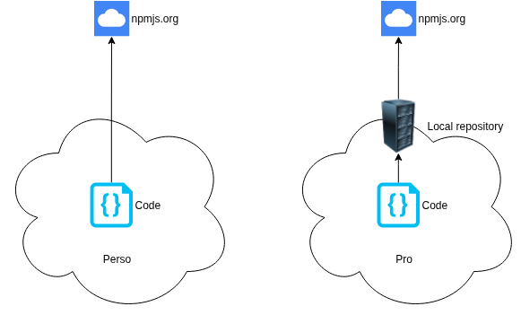
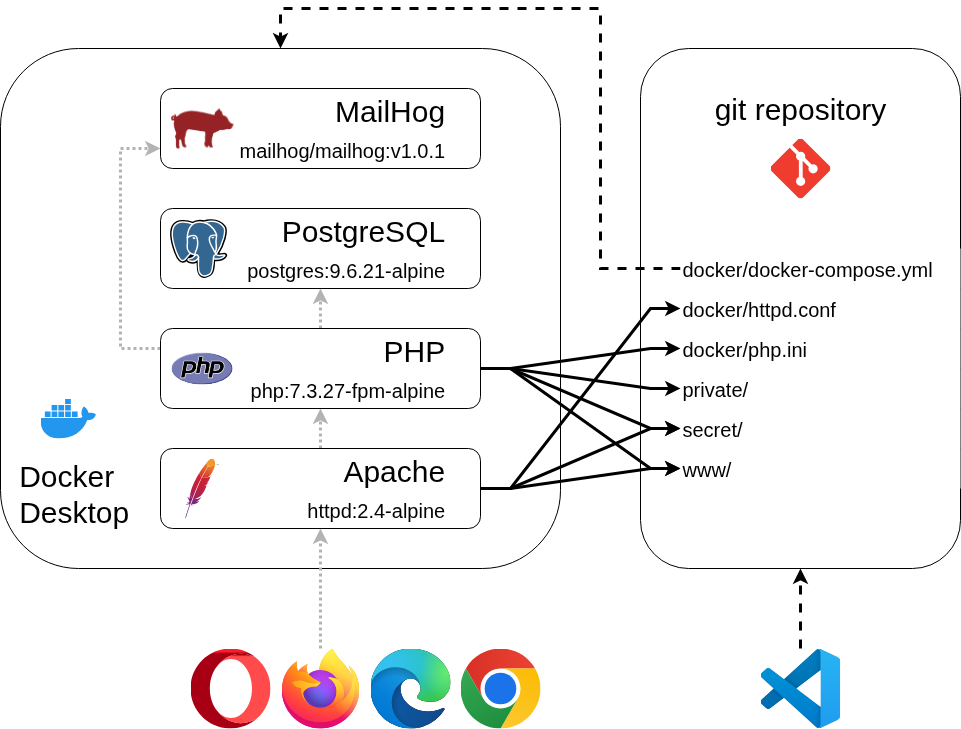
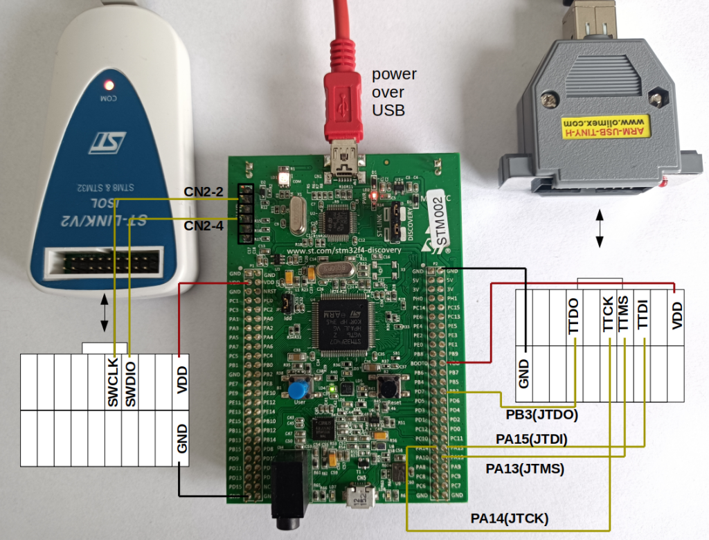
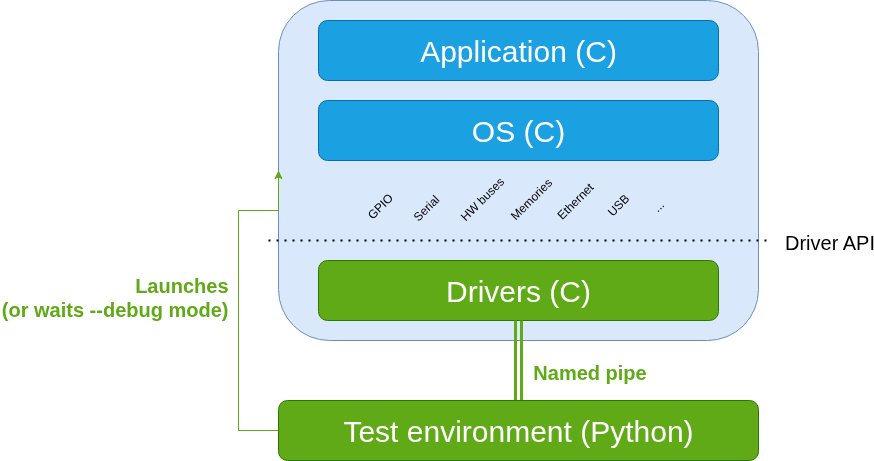

<link rel="stylesheet" href="css/styles.css"></link>

<h1>Environnements de développement logiciel</h1>


Alexis ROYER - https://www.linkedin.com/in/alexis-royer/

2025-2026


---

Ce document constitue un cours d'ingénierie logicielle,
plus particulièrement sur la mise en oeuvre des environnements de développement.

L'environnement de développement contribue à l'efficience des activités,
et par conséquent à la qualité d'un logiciel produit,
d'où l'importance de maîtriser l'environnement de travail pour l'ensemble d'une équipe.

---

Source : https://github.com/alxroyer/edu-sw-dev-env/

Ce document est rédigé en format Markdown suivi sous git à dessein,
pour démontrer le format Markdown
et comment on peut l'utiliser pour la constitution de documentations techniques,
ainsi que les capacités de suivi de version et de travail collaboratif apportées par git sur un format texte.

---


Sommaire :

<!--
Mémo:
- Utilisation d'un titre HTML h1 en tête de document,
  pour éviter la confusion avec les titres de niveau 1 par l'extension "Auto Markdown TOC"
-->

<!-- TOC -->

- [1. Avant-propos](#1-avant-propos)
    - [1.1. Types de logiciel](#11-types-de-logiciel)
    - [1.2. Technos et langages](#12-technos-et-langages)
    - [1.3. Environnements de développement et qualité logicielle](#13-environnements-de-d%C3%A9veloppement-et-qualit%C3%A9-logicielle)
- [2. Développement](#2-d%C3%A9veloppement)
    - [2.1. IDE - Integrated Development Environment](#21-ide---integrated-development-environment)
    - [2.2. Debugging](#22-debugging)
    - [2.3. Bibliothèques de packages](#23-biblioth%C3%A8ques-de-packages)
        - [2.3.1. Fonctionnement](#231-fonctionnement)
        - [2.3.2. Contraintes techniques](#232-contraintes-techniques)
        - [2.3.3. Contraintes juridiques](#233-contraintes-juridiques)
            - [2.3.3.1. Licences commerciales](#2331-licences-commerciales)
            - [2.3.3.2. Licences Open Source](#2332-licences-open-source)
            - [2.3.3.3. Licences hybrides](#2333-licences-hybrides)
        - [2.3.4. Risques de sécurité](#234-risques-de-s%C3%A9curit%C3%A9)
        - [2.3.5. Utilisation d'un miroir local](#235-utilisation-dun-miroir-local)
    - [2.4. Build](#24-build)
        - [2.4.1. Compilateurs / linkers](#241-compilateurs--linkers)
        - [2.4.2. Bundlers Javascript](#242-bundlers-javascript)
        - [2.4.3. Transpilation Typescript](#243-transpilation-typescript)
        - [2.4.4. Gestionnaires de projets](#244-gestionnaires-de-projets)
            - [2.4.4.1. Makefile, les origines](#2441-makefile-les-origines)
            - [2.4.4.2. CMake](#2442-cmake)
            - [2.4.4.3. Des configurations de mieux en mieux intégrées](#2443-des-configurations-de-mieux-en-mieux-int%C3%A9gr%C3%A9es)
    - [2.5. Industrialisation](#25-industrialisation)
        - [2.5.1. Pratiques d'équipe](#251-pratiques-d%C3%A9quipe)
        - [2.5.2. Règles de codage](#252-r%C3%A8gles-de-codage)
        - [2.5.3. Git](#253-git)
        - [2.5.4. Automatisations](#254-automatisations)
            - [2.5.4.1. Scripting](#2541-scripting)
            - [2.5.4.2. Chaîne CI](#2542-cha%C3%AEne-ci)
        - [2.5.5. Conteneurs Docker d'outillages](#255-conteneurs-docker-doutillages)
        - [2.5.6. Documentation](#256-documentation)
- [3. Exécution](#3-ex%C3%A9cution)
    - [3.1. Exécution des applications PC](#31-ex%C3%A9cution-des-applications-pc)
    - [3.2. Exécution des applications Web](#32-ex%C3%A9cution-des-applications-web)
        - [3.2.1. Exécution locale](#321-ex%C3%A9cution-locale)
        - [3.2.2. Exécution distante + développement en Remote SSH](#322-ex%C3%A9cution-distante--d%C3%A9veloppement-en-remote-ssh)
        - [3.2.3. Conteneurs Dockers locaux](#323-conteneurs-dockers-locaux)
        - [3.2.4. Chaîne CD sur plateforme de test](#324-cha%C3%AEne-cd-sur-plateforme-de-test)
    - [3.3. Exécution des applications mobile](#33-ex%C3%A9cution-des-applications-mobile)
        - [3.3.1. Exécution sur smartphone physique](#331-ex%C3%A9cution-sur-smartphone-physique)
        - [3.3.2. Emulateurs sur poste de développement](#332-emulateurs-sur-poste-de-d%C3%A9veloppement)
        - [3.3.3. Emulateurs dans le cloud](#333-emulateurs-dans-le-cloud)
        - [3.3.4. Expo & Expo Go](#334-expo--expo-go)
    - [3.4. Exécution des logiciels embarqués](#34-ex%C3%A9cution-des-logiciels-embarqu%C3%A9s)
        - [3.4.1. Exécution sur cible hardware](#341-ex%C3%A9cution-sur-cible-hardware)
            - [3.4.1.1. OS riche](#3411-os-riche)
            - [3.4.1.2. Bootloader](#3412-bootloader)
            - [3.4.1.3. Programmation mémoire](#3413-programmation-m%C3%A9moire)
        - [3.4.2. Exécution dans un émulateur](#342-ex%C3%A9cution-dans-un-%C3%A9mulateur)
        - [3.4.3. Exécution en mode simulé X86](#343-ex%C3%A9cution-en-mode-simul%C3%A9-x86)
    - [3.5. Stratégie de logs](#35-strat%C3%A9gie-de-logs)
- [4. Delivery / déploiement](#4-delivery--d%C3%A9ploiement)
    - [4.1. Enregistrements de livrables](#41-enregistrements-de-livrables)
        - [4.1.1. Répertoires partagés, GED](#411-r%C3%A9pertoires-partag%C3%A9s-ged)
        - [4.1.2. Enregistrement sous git](#412-enregistrement-sous-git)
        - [4.1.3. Dépôt de binaires](#413-d%C3%A9p%C3%B4t-de-binaires)
        - [4.1.4. Enregistrement dans les dépôts publics](#414-enregistrement-dans-les-d%C3%A9p%C3%B4ts-publics)
    - [4.2. Applications PC](#42-applications-pc)
        - [4.2.1. Applications Windows](#421-applications-windows)
        - [4.2.2. Applications Linux](#422-applications-linux)
        - [4.2.3. Applications Mac](#423-applications-mac)
    - [4.3. Applications Web](#43-applications-web)
        - [4.3.1. Scalabilité](#431-scalabilit%C3%A9)
        - [4.3.2. Chaîne CD](#432-cha%C3%AEne-cd)
        - [4.3.3. Deploy as code](#433-deploy-as-code)
        - [4.3.4. DevOps](#434-devops)
    - [4.4. Applications mobiles](#44-applications-mobiles)
    - [4.5. Logiciels embarqués](#45-logiciels-embarqu%C3%A9s)
- [5. Assurance qualité](#5-assurance-qualit%C3%A9)
    - [5.1. Versioning / Gestion de configuration](#51-versioning--gestion-de-configuration)
        - [5.1.1. SemVer](#511-semver)
        - [5.1.2. Source control - git](#512-source-control---git)
            - [5.1.2.1. Git, les bases](#5121-git-les-bases)
            - [5.1.2.2. Investiguer avec git](#5122-investiguer-avec-git)
            - [5.1.2.3. Stratégie git](#5123-strat%C3%A9gie-git)
            - [5.1.2.4. Plateformes git](#5124-plateformes-git)
            - [5.1.2.5. Git, mode expert](#5125-git-mode-expert)
        - [5.1.3. Ticketing](#513-ticketing)
        - [5.1.4. Index de configuration](#514-index-de-configuration)
        - [5.1.5. PLM - Product Lifecicle Management](#515-plm---product-lifecicle-management)
        - [5.1.6. Archivage](#516-archivage)
    - [5.2. Automatisations](#52-automatisations)
    - [5.3. Documentation](#53-documentation)
        - [5.3.1. GED](#531-ged)
        - [5.3.2. CMS](#532-cms)
        - [5.3.3. Formats texte + git](#533-formats-texte--git)

<!-- /TOC -->


# 1. Avant-propos

## 1.1. Types de logiciel

Avant toute chose, il convient de considérer que la mise en oeuvre d'un environnement de développement
est fortement dépendante du type de logiciel développé.

On distingue différents types de logiciels :
- <span class="sw-type pc"></span> les applications PC (Windows, Mac, Linux),
- <span class="sw-type web"></span> les applications web (front et back),
- <span class="sw-type mobile"></span> les applications mobile (Android, iPhone),
- <span class="sw-type embedded"></span> les logiciels embarqués.


## 1.2. Technos et langages

Pour chacun des types de logiciels, des technologies différentes peuvent être mises en jeu (liste non exhaustive) :
- <span class="sw-type pc"></span>
  Applications PC :
    - Langages :
        - C / C++
        - Java
        - Node.js (1) / Typescript (2)
        - Python
        - Go : exemple [esbuild](https://esbuild.github.io/faq/#why-is-esbuild-fast) (6)
        - Rust (3)
    - Systèmes d'exploitation :
        - Windows
        - Mac
        - Linux
    - Frameworks :
        - Qt (4)
        - React Native (4)
- <span class="sw-type web"></span>
  Applications web :
    - Langages :
        - HTML
        - Côté *frontend* :
            - Javascript / Typescript (2)
        - Côté *backend* :
            - Node.js (1) / Typescript (2)
            - Java
            - PHP
            - Ruby
            - Python
            - C / C++
            - Go (6)
    - Frameworks :
        - Angular (Javascript)
        - Vue.js (Javascript)
        - React Native (Javascript) (4)
        - Symfony (PHP)
        - Ruby on Rails
- <span class="sw-type mobile"></span>
  Applications mobiles :
    - Architectures / systèmes d'exploitation :
        - Android
        - iOS
    - Langages :
        - Java, Kotlin (Android)
        - Swift (iOS)
        - Objective-C (iOS)
        - C (Code natif Android & iOS)
    - Frameworks :
        - React Native (4)
    - Kits de développement :
        - SDK Android : Software Development Kit
        - NDK Android : Native Development Kit
- <span class="sw-type embedded"></span>
  Logiciels embarqués :
    - Langages :
        - C / C++
        - Go ? à confirmer (6)
        - Rust (3)
    - Systèmes d'exploitation :
        - Linux : couramment utilisé pour réaliser des systèmes embarqués. (5)
        - vxWorks : système d'exploitation dit *temps-réel*, propriétaire, développé par Wind River.
        - µC-OS : OS minimaliste, sans système de fichier, pile IP, ... par défaut.
        - Sans OS : simple boucle de réaction sur événement.
    - Frameworks / kits de développement :
        - buildroot

> Notes :
> - (1) Node.js : extension de Javascript, initialement restreint aux navigateurs, avec exécution par un moteur dédié.
> - (2) Typescript : extension de la syntaxe Javascript pour permettre le typage.
> - (3) Rust est un langage de programmation compilé, relativement nouveau,
>   dont un des objectifs principaux est la sécurisation de la gestion de la mémoire.
>   De fait, certains le présentent comme le successeur de C / C++.
> - (4) Certains frameworks ont l'avantage d'être *cross-platform*,
>   c'est à dire qu'ils permettent de réaliser un seul développement utilisable sur différents environnements
>   (plateformes et/ou systèmes d'exploitation).
> - (5) L'OS Linux, même dans une version embarquée, n'est pas considéré comme un OS *temps-réel*,
>   c'est-à-dire qu'il ne garantit pas un temps d'exécution pour un traitement donné.
>   L'occupation mémoire est plus importante que pour un OS minimaliste.
>   En revanche, il a l'avantage de fournir un écosystème riche de services et d'outils qui peut faciliter les développements.
> - (6) Go plebiscité pour ses capacités de gestion multi-thread,
    qui peut avoir son intrêt pour le développement d'applications avec des contraintes de perfs.
    Langage un peu spécifique, qui nécessite une phase d'apprentissage spécifique.

Le choix du langage et des technologies peut dépendre de plusieurs facteurs :
- en premier lieu, de la nature du logiciel développé,
- mais aussi des caractéristiques attendues :
  performances, empreinte mémoire, look & feel, ...
- de la culture d'entreprise : compétences disponibles en interne,
- de la stratégie d'entreprise :
  volonté d'investir sur telle ou telle technologie,
  ou de rationaliser les technologies utilisées, ...
- de la disponibilité des compétences sur le marché de l'emploi :
  capacité à staffer des équipes, assurer la maintenance dans le temps, ...
- ...

Quoi qu'il en soit, le langage et les technologies retenus
conditionnent fortement l'environnement de développement à mettre en place.

> ℹ️ **Vidéos pour le fun**
>
> Most popular coding language 2012 - 2024 :
> https://www.youtube.com/watch?v=viPKPhOUcyU
>
> Most Popular Programming Languages 1955 - 2025 :
> https://www.youtube.com/watch?v=5yAbVkIMl_M


## 1.3. Environnements de développement et qualité logicielle

La norme ISO 9126, ainsi que l'ISO 25010 qui la remplace aujourd'hui,
identifient différentes dimensions pour la caractérisation de la qualité d'un logiciel.
Entre autres (1) :
- Capacité fonctionnelle
- Facilité d'utilisation
- Fiabilité
- Performance
- Maintenabilité
- Portabilité

Une partie de ces dimensions reste essentiellement portée par le logciel développé.

Toutefois, l'environnement de développement peut contribue à certaines de ces dimensions, notamment :
- Fiabilité :
    - Mettre en oeuvre des outils d'analyse de code statique, permettant d'éviter des bugs avant même d'exécuter le code.
    - Exécuter régulièrement des tests de non-régression, pour détecter les problèmes au plus tôt.
- Maintenabilité :
    - Assurer un maximum de confort pour les développeurs, de sorte à faciliter le codage, le debugging...
      de par le choix des outils, pour leurs fonctionnalités, et sans oublier leurs performances !
      Faire en sorte de limiter les freins aux différentes actions nécessaires à la réalisation d'un logiciel de qualité.
    - Faciliter notamment les refactorings, nécessaires à la maintenabilité.
    - Utiliser un outil de versioning (git).
    - Automatiser les vérifications de qualité (linters, indentation) pour s'assurer d'un certain niveau de lisibilité du code,
      donc un code plus facile à maintenir, à suivre en historique.
- Portabilité :
    - Exécution des tests de non-régression sur les différentes cibles.

> ℹ️ **(1) Accès aux normes ISO**
>
> La difficulté des normes ISO est que celles-ci ne sont pas libres d'accès.
>
> En effet, le site de référence de l'ISO ne fournit qu'une prévisualisation
> de la version en cours de la norme ISO 25010 :
> https://www.iso.org/obp/ui/#iso:std:iso-iec:25010
>> *To view the full content, you will need to purchase the standard by clicking on the "Buy" button.*
>
> Toujours sur le site de référence,
> difficile de trouver une telle prévisualisation pour l'ISO 9126.
>
> La liste simplifiée ci-dessus est tirée de la page Wikipédia https://fr.wikipedia.org/wiki/Qualit%C3%A9_logicielle


# 2. Développement

Avant de délivrer et exécuter le logiciel, commençons par mettre en oeuvre les éléments permettant de le construire.


## 2.1. IDE - Integrated Development Environment

Un des premiers outils qu'on est amené à aborder pour faire du développement logiciel est l'IDE.

L'usage d'un IDE présente de nombreux intérêts :

- Edition de code :
  Basique, un simple notepad (voire `vi` pour les puristes !)
  pourrait faire le job.

- Coloration syntaxique :
  Ca change déjà un peu la vie,
  dans la mesure où ça fluidifie la lecture du code.

- Navigation :
  Capacité à aller directement sur le code d'une variable ou d'une fonction,
  ou dans le code Markdown d'un chapitre donné.
  Possibilité de gagner du temps,
  en évitant de scroller et de faire des CTRL+F dans tous les sens
  quand le code commence à prendre du volume.

- Complétion :
  La complétion apporte un vrai plus,
  en évitant des fautes de frappe
  donc des erreurs chronophages au passage.

  > ⚠️ **Attention : Complétion et fautes d'orthographe**
  >
  > Il existe un risque avec la complétion de répliquer
  > des fautes d'orthographe ou des dyslexies
  > sur les noms de variables ou de fonctions
  > dans la totalité de code.
  >
  > Le cas échéant, avoir le réflexe d'utiliser les fonction de refactoring
  > pour corriger le tir.

- Refactoring :
  On gagne encore plus du temps.
  On n'hésite plus à renommer une variable, une fonction, une classe,
  pour lui redonner un nom plus adapté, allant dans le sens de la maintenabilité.

- Edition multi-lignes :
  Capacité mise à disposition par un certain nombre d'éditeurs de texte,
  à laquelle on s'habitue très vite dès lors qu'on commence à l'utiliser.

- Debugging :
  Dès lors que c'est possible,
  permet d'obtenir plein d'informations utiles
  dans le cadre de résolution d'un bug.
  Possibilité également d'utiliser les fonctions de debugging
  pour tester des injections de fautes.

- IA :
  Les IDE intègrent aujourd'hui des fonctions d'IA
  qui peuvent augmenter la productivité.

  > ⚠️ **Attention : IA et confidentialité**
  >
  > A ce jour, l'IA fonctionne principalement par communication d'informations sur des moteurs s'exécutant sur Internet.
  >
  > L'utilisation de l'IA dans les IDE peut donc être problématique si l'entreprise ne souhaite pas divulguer le code.
  >
  > Bien se renseigner sur les usages possibles ou non.
  >
  > Possible que l'entreprise dispose d'un contrat de confidentialité avec une IA donnée,
  > voire héberge une solution d'IA *on-premises*,
  > auquel cas on pourra configurer les IDE pour utiliser cette IA validée par l'entreprise.

On liste ci-après des IDE connus (liste non exhaustive) :
- <span class="sw-type pc"></span> Applications PC :
    - Visual C++
    - Eclipse : Java, mais aussi C / C++ (version CDT)
    - VS Code : Node.js, Typescript, mais aussi C / C++ (extension)
    - JetBrains IntelliJ IDEA : Java
    - JetBrains PyCharm : Python
- <span class="sw-type web"></span> Applications web :
    - VS Code : HTML, Javascript, Typescript, PHP
    - PHPStorm
    - JetBrains IntelliJ IDEA : Java
- <span class="sw-type mobile"></span> Applications mobile :
    - Android Studio
    - JetBrains IntelliJ IDEA : Java, Kotlin
    - XCode : iOS
- <span class="sw-type embedded"></span> Logiciel embarqué :
    - VS Code : C / C++ (extension), Rust (extension)
    - Eclipse : C / C++ (version CDT)

Le tableau ci-après donne un aperçu historisé de l'apparition de certains des IDE précédemment cités :
> Source : https://chat.mistral.ai/, sous réserve de confirmation des informations.

| IDE           | Langages   | Description | Historique |
|---------------|------------|-------------|------------|
| Turbo Pascal  | Pascal     | L'un des premiers IDE modernes. | 1983 |
| Visual Studio | C, C++, C# | Développé par Microsoft. | 1997 |
| NetBeans      | Java, PHP, C/C++ | IDE polyvalent, version Open Source. | 2000 |
| Eclipse       | Java, C++ (plugin CDT, 2004) | IDE open source, pour Java, en Java, extensible par plugins, réputation de lourdeur. | 2001 |
| IntelliJ IDEA | Java, ...  | IDE populaire, développé par JetBrains, extensible par plugins. | 2001 |
| Xcode         | C, Objective-C, Swift | IDE d'Apple pour le développement macOS et iOS. | 2003 |
| PyCharm       | Python     | Egalement développé par JetBrains. | 2010 |
| VS Code       | HTML, CSS, JS/Typescript, Markdown, ... | Éditeur de code léger et extensible, développé en JS par Microsoft, écosystème riche de plugins. | 2015 |

> <span class="sw-type pc"></span> 👷🛠️ TP : [Configuration d'un IDE VS Code pour C/C++](TP%20-%20IDE%20VS%20Code%20C-Cpp.md)

> 👷🛠️ TP : Refactoring (TODO)


## 2.2. Debugging

> ℹ️ **Environnements d'exécution**
>
> On parle de debugging dès à présent,
> car c'est une des fonctions majeures apportées par un IDE
> facilitant l'investigation et la résolution de bugs logiciels.
>
> Cela entend qu'on sait exécuter notre logiciel au préalable
> (cf. [§3](#3-ex%C3%A9cution)).
> La notion reste toutefois abordable
> en considérant le cas simple des applications PC dans un premier temps.

Les débuggers (tels `gdb`) peuvent généralement s'utiliser en ligne de commande.
Toutefois, cela reste extrêmement compliqué,
et l'utilisation d'une interface graphique est quasiment indispensable pour débugguer efficacement.

Les IDE intègrent très bien les débuggeurs,
et permettent ainsi de basculer très rapidement entre les modes édition de code et debugging / intégration.

Parmi les fonctions utiles d'un debugger, on note :
- la possibilité de positionner des points d'arrêt (*breakpoints*)
- l'exécution pas à pas, i.e. ligne à ligne,
- l'observation des valeurs de variables,
- rentrer dans l'exécution des fonctions (et en ressortir)
- l'affichage de la pile d'appels (*callstack*)
- la possibilité de définir un point d'arrêt sur modification de valeur :
  très utile pour investiguer des problèmes de débordement mémoire
- la capacité à modifier des valeurs de données :
  utile pour tester des injections de fautes
- la capacité pour certains langages interprétés (Python, JS) à pouvoir exécuter des routines à chaud
- ...

> <span class="sw-type pc"></span> 👷🛠️ TP : [Debugging C/C++ avec VS Code](TP%20-%20Debugging%20VS%20Code%20C-Cpp.md)

Dans le cas du debugging d'un logiciel embarqué, la difficulté est de savoir synchroniser
un IDE/debugger qui tourne sur une machine de développement,
et le programme à débugguer qui tourne sur une cible autre.
Pour ce faire, on peut utiliser des moyens spécifiques :
- `gdbserver` :
    - Possible pour des cibles tournant sous Linux uniquement.
    - Le programme à débugguer est lancé sur la cible avec `gdbserver`,
      et le debugger sur la machine de développement se connecte au `gdbserver` en tant que client.
    - J'ai déjà constaté personnellement que la connexion pouvait être instable.
      Pas de garantie notamment que les points d'arrêts soient bien pris en compte,
      notamment dans des cas d'applicatifs multi-threadés.
- Utilisation d'une sonde :
    - Matériel de sonde spécifique au micro-processeur de la cible.
    - Branchement sur un bus série dédié, directement sur le micro-processeur sur la cible.
      Nécessite que les signaux aient été routés sur la carte.

> <span class="sw-type embedded"></span> 👷🛠️ TP : Debugging C/C++ à distance avec gdbserver (TODO)

On note finalement que les investigations par debugging ont leurs limitent :
- Pas de debugging possible *post-mortem*,
  i.e. après constat d'un problème après que l'exécution du logiciel soit terminée
  (cas typique d'une exception ou d'un crash constaté en prod)
  et tant qu'on n'a pas caractérisé les conditions de reproduction du problème.
- Il arrive fréquemment que le fait de poser des points d'arrêts provoque des effets de bords
  sur des timeouts qui arrivent à échéance, et donc des effets indésirables empêchant un debugging confortable.
- Dans le cas des logiciels embarqués, comme le logiciel s'exécute sur une cible autre,
  le debugging est par nature moins facile à mettre en oeuvre.
- Cas en Python où le débuggueur exécute automatiquement des routines `__repr__()`
  pour obtenir une représentation des représentation des objets
  à afficher dans l'IHM de debug,
  ces exécutions surnuméraires pouvant provoquer des effets de bords indésirables selon les cas.

En raison de ces limitations, la bonne vieille technique du debugging "à la trace" ne doit pas être négligée
(cf. [§3.5](#35-strat%C3%A9gie-de-logs)).


## 2.3. Bibliothèques de packages

### 2.3.1. Fonctionnement

Aujourd'hui, on écrit rarement l'intégralité du code d'un logiciel.
On repose généralement sur un écosystème riche de frameworks et de librairies.

Ces écosystèmes de frameworks ou librairies s'organisent généralement en deux parties :

- une *registry* en ligne :
  un site gérant une bibliothèque de librairies.

    - Ces sites permettent de naviguer dans la bibliothèque de librairies,
      faire des recherches, ...
    - Chaque librairie est documentée :
      auteur, versions, dépendances, ...
    - On peut télécharger chacune des librairies
      pour les installer *à la main*.

  > ℹ️ **Packages**
  >
  > Les frameworks ou librairies pouvant être constitués de différents éléments
  > (code source, licence, documentation, scripts utiles, ...),
  > le téléchargement est facilité par le conditonnement dans une archive unique.
  >
  > On nomme généralement cette archive un *package*.
  >
  > Certaines technos affectent un nom spécifique pour ces packages,
  > comme Rust qui nomme ses packages des *crates*.

- un programme s'exécutant en local, permettant de :

    - gérer un projet : build, debug, test, ...
      c'est l'équivalent de ce qu'on peut faire *à la main* avec un Makefile
      (cf. [§2.4.4](#244-gestionnaires-de-projets)),
    - déclarer les packages qu'on souhaite utiliser
      au travers du projet géré par l'outil,
    - s'interfacer avec la *registry*,
    - résoudre les dépendances des librairies.

Il existe différents systèmes de packages,
généralement centrés sur une technologie donnée.

On liste ci-après des systèmes de packages usuels (liste non exhaustive) :
- <span class="sw-type pc"></span> Applications PC :
    - JS : npm / yarn / pnpm (1)
    - Java : maven
    - Python : pip / venv
- <span class="sw-type web"></span> Applications web :
    - JS : npm / yarn / pnpm (1)
    - PHP : composer
    - Java : maven
- <span class="sw-type mobile"></span> Applications mobile :
    - Android : repo (2)
    - iOS : `swift package`
- <span class="sw-type embedded"></span> Logiciel embarqué :
    - C/Linux : buildroot (3)
    - Rust : Cargo

Le tableau ci-après donne un aperçu historisé
de l'apparition de certains des systèmes de packages précédemment cités :
> Source : https://chat.mistral.ai/, sous réserve de confirmation des informations.

| Langage | Outil projet                  | Fichiers projet                      | Registry                               | Historique |
|---------|-------------------------------|--------------------------------------|----------------------------------------|------------|
| Perl    | cpan                          | cpanfile                             | https://metacpan.org/                  | 1995       |
| C/Linux | buildroot (3)                 | Fichiers *defconfig*                 | https://buildroot.org/                 | 2001       |
| Java    | mvn V1 (2002), V2 (2008)      | pom.xml                              | https://search.maven.org/ (2005)       | 2002       |
| Python  | pip, venv                     | requirements.txt, pyproject.toml, pylock.toml (4) | https://pypi.org/         | 2003       |
| Ruby    | gem                           | Gemfile                              | https://rubygems.org/                  | 2004       |
| JS      | npm, yarn (2016), pnpm (2017) | package.json, package-lock.json      | https://www.npmjs.com/                 | 2010       |
| PHP     | composer                      | composer.json, composer.lock         | https://packagist.org/                 | 2012       |
| Go      | `go get`                      | go.mod, go.sum                       | https://pkg.go.dev/                    | 2012       |
| Rust    | cargo                         | Cargo.toml, Cargo.lock               | https://crates.io/                     | 2014       |
| Swift   | `swift package`               | Package.swift, Package.resolved      | https://www.swift.org/package-manager/ | 2016       |

> ℹ️ **Notes**
>
> - (1) yarn et pnpm constituent des améliorations de npm.
>
>   - yarn, d'après https://yarnpkg.com/ : "Safe, stable, reproducible projects"
>   - pnpm, d'après https://pnpm.io/ : "Save time. Save disk space. Supercharge your monorepos."
>
>   J'ai effectivement pu constater personnellement que npm pouvait avoir des limitations
>   dans des cas particuliers.
>
>   C'était notamment le cas pour la gestion de différentes versions d'un même package
>   (en l'occurrence React Native)
>   pour les différentes targets dans un monorepo
>   (cf. issue [npm#287](https://github.com/npm/rfcs/issues/287)).
>
>   En raison de ces difficultés, j'étais passé sur yarn.
>
> - (2) `repo` n'est pas vraiment un système de packages,
>   mais plutôt une extension de git
>   permettant de manipuler un grand nombre de dépôts dans l'espace projet.
>
>   Il n'y a pas vraiment de *registry* en ligne pour `repo`,
>   mais simplement des dépôts git.
>
> - (3) buildroot n'est pas vraiment centré sur un langage,
>   mais sur des ensembles de librairies et logiciels
>   pouvant être embarqués dans l'image Linux constituée.
>
>   En un sens, cela ressemble plus à des systèmes de packages pour l'OS Linux,
>   comme rpm (Red Hat Package Manager pour l'origine du nom)
>   ou apt/dpkg (packages Debian .deb),
>   à la différence que les packages ne sont pas téléchargés sous forme de binaires,
>   mais de sources pour être cross-compilés.
>
>   On retrouvera classiquement pour Linux beaucoup de code C,
>   mais pas uniquement.
>
> - (4) Bien que la [PEP 518](https://peps.python.org/pep-0518/) *(Python Enhancement Proposal)*
>   pour la définition des fichiers `pyproject.toml` date de 2016,
>   la spécification des fichiers `pylock.toml` date de 2025 seulement
>   (cf. https://packaging.python.org/en/latest/specifications/pylock-toml/).
>
>   Compte tenu du caractère récent de ces spécifications,
>   l'usage des fichiers `requirements.txt` semble rester d'actualité.

> 👷🛠️ TP : [API REST en JS avec npm](TP%20-%20REST%20API%20npm-ts.md)

> 👷🛠️ TP : API REST en Python avec pip et venv (TODO)

> 👷🛠️ TP : API REST en PHP avec composer (TODO)

> 👷🛠️ TP : API REST en Go avec `go get` et `go build` (TODO)
>
> Memo :
> - https://go.dev/ref/mod#go-mod-init
> - https://go.dev/doc/modules/managing-dependencies
> - https://go.dev/doc/modules/gomod-ref
> - https://go.dev/doc/tutorial/compile-install

> 👷🛠️ TP : [API REST en Rust avec cargo](TP%20-%20REST%20API%20cargo-rust.md)

> 👷🛠️ TP : Image Linux avec buildroot (TODO, penser à enregistrer le fichier *defconfig*)

Si le fait d'utiliser des librairies tierces permet de faciliter et d'accélérer les développements,
cela ne va pas sans certains inconvénients.


### 2.3.2. Contraintes techniques

Comme on peut le voir, certains projets peuvent être amenés à tirer un volume conséquent de packages.

Dans ce genre de situation, de façon assez évidente,
cela implique des contraintes sur l'espace disque utilisé.

Mais, avec un nombre important de packages utilisés,
cela augmente également fortement le nombre d'accès disque,
ce qui peut amener de vraies lenteurs sur les commandes de gestion des packages.

> 💡 **Astuce : Privilégier un disque SSD**
>
> Il peut ainsi être intéressant de privilégier l'utilisation de disques SSD
> pour éviter des phénomènes de lenteur.
>
> J'ai eu l'occasion de constater de vrais gains avec un disque SSD
> dans certains cas de figure :
> - multiplicité des dépôts git Android tirés avec la commande `repo`,
> - volume de packages tirés dans un monorepo JS avec React Native.


### 2.3.3. Contraintes juridiques

Toute librairie logicielle vient généralement avec une licence d'utilisation.

Les développeurs ont leur part de responsabilité vis-à-vis des licences tirées
en fonction des choix de technologies opérés.


#### 2.3.3.1. Licences commerciales

Il existe différents modes de facturation :
- au nombre de développeurs,
- par famille de produits,
- au runtime, i.e. par unité produite (souvent le plus coûteux),
- ...

Lorsque la licence est commerciale, penser à s'acquitter des droits à payer !

Tout oubli de règlement des licences commerciales peut se payer très cher devant les tribunaux,
notamment lorsqu'on intègre les arriérés, plus probalement des pénalités à la clé !


#### 2.3.3.2. Licences Open Source

Attention !
Open Source ne veut pas dire libre de droits.

Il existe différents types de licences Open Source plus ou moins permissives.

Le premier tableau ci-après donne une liste des principales licences dites permissives.

Ces licences permissives restent compatibles avec le développement d'un logiciel propriétaire,
à la condition toutefois de se conformer aux termes de la licence.

> Source : https://chat.mistral.ai/, sous réserve de confirmation des informations.

| Licence | Identifiant SPDX (1) | Principales caractéristiques | Exemples |
|---------|----------------------|------------------------------|----------|
| [MIT](https://opensource.org/licenses/MIT) *(Massachusetts Institute of Technology)* | [MIT](https://spdx.org/licenses/MIT.html) | Utilisation, modification et distribution libres, y compris dans des projets propriétaires. Seule obligation : conserver la notice de copyright et la décharge de responsabilité. | Ruby on Rails, jQuery |
| [ISC](https://opensource.org/licenses/ISC) *(Internet Software Consortium)* | [ISC](https://spdx.org/licenses/ISC.html) | Similaire à MIT, mais avec une formulation plus simple. Proposée par défaut dans l'écosystème JS. | npm |
| [BSD](https://opensource.org/licenses/BSD-2-Clause) *(Berkeley Software Distribution)* | [BSD-3-Clause](https://spdx.org/licenses/BSD-3-Clause.html), [BSD-2-Clause](https://spdx.org/licenses/BSD-2-Clause.html), [0BSD](https://spdx.org/licenses/0BSD.html) | Similaire à MIT, mais plus précise en termes de limitation de responsabilité du développeur vis-à-vis des usages faits du logiciel. Existe en différentes versions (nombre de clauses). | FreeBSD, NetBSD |
| [Apache 2.0](https://opensource.org/licenses/Apache-2.0) | [Apache-2.0](https://spdx.org/licenses/Apache-2.0.html) | Protection contre les brevets et clause de non-responsabilité. Compatible avec la GPLv3. Obligation de conserver les notices de licence et de ne pas utiliser les marques déposées. | Apache HTTP Server, Apache Kafka, une grande partie de code Android |

Le second tableau suivant liste des licences dites *copyleft faible*.

Ce type de licences reste compatible avec le développement d'un logiciel propriétaire,
mais impose généralement la reversion des modifications qui pourraient être apportées
dans le code Open Source utilisé.

> Source : https://chat.mistral.ai/, sous réserve de confirmation des informations.

| Licence | Identifiant SPDX (1) | Principales caractéristiques | Exemples |
|---------|----------------------|------------------------------|----------|
| [LGPL](https://opensource.org/license/lgpl-3-0) *(Lesser GPL)* | [LGPL-3.0-only](https://spdx.org/licenses/LGPL-3.0-only.html), ... | Permet l’utilisation dans des logiciels propriétaires, mais les modifications de la bibliothèque LGPL doivent rester open source (i.e. obligation de publication des modifications). | GTK |
| [MPL 2.0](https://opensource.org/license/MPL-2.0) *(Mozilla Public License 2.0)* | [MPL-2.0](https://spdx.org/licenses/MPL-2.0.html) | Copyleft faible par fichier. | Firefox, Thunderbird |

Enfin, le troisième tableau liste des licences dites *copyleft fort* parmi les plus connues.

Ces licences imposent à un logiciel *dérivé* d'adopter lui-même la licence Open Source.

Ce qu'il faut entendre par logiciel *dérivé*
c'est entre autres le fait de se *linker* avec le logiciel Open Source.

C'est pourquoi on qualifie ces licences de *contaminantes*.

De fait, une librairie avec ce type de licence est généralement incompatible
avec le développement d'un logiciel propriétaire.

> Source : https://chat.mistral.ai/, sous réserve de confirmation des informations.

| Licence | Identifiant SPDX (1) | Principales caractéristiques | Exemples |
|---------|----------------------|------------------------------|----------|
| [GPL](https://opensource.org/license/gpl-3-0) *(GNU General Public License)* | [GPL-2.0-only](https://spdx.org/licenses/GPL-2.0-only.html), [GPL-3.0-only](https://spdx.org/licenses/GPL-3.0-only.html), ... | Toute oeuvre dérivée doit être distribuée sous GPL également. La version en vigueur est la V3, mais on trouve également beaucoup de V2. | Linux, gcc |
| [AGPL](https://opensource.org/license/agpl-v3) *(Affero GPL)* | [AGPL-3.0-only](https://spdx.org/licenses/AGPL-3.0-only.html), ... | Similaire à la GPL (licence contaminante), mais étend les obligations aux logiciels utilisés en réseau (SaaS). | itext |
| [SSPL](https://www.mongodb.com/legal/licensing/server-side-public-license) *(Server Side Public License)* (2) | [SSPL-1.0](https://spdx.org/licenses/SSPL-1.0.html) | Licence créée par MongoDB, inspirée de AGPL. | MongoDB, ElasticSearch |

> ℹ️ **Notes**
>
> - (1) [SPDX](https://spdx.dev/) *(System Package Data Exchange)*,
>   est un standard ouvert permettant de spécifier la décomposition d'un logiciel,
>   via une SBOM *(Software Bill of Materials)*.
>
>   Ce standard propose des codification des licences logicielles
>   (cf. https://spdx.org/licenses/).
>
> - (2) Controverse :
>   SSPL n'est pas reconnue comme une licence Open Source à part entière
>   par l'[OSI](https://opensource.org/) *(Open Source Initiative)*.
>   Cf. https://opensource.org/blog/the-sspl-is-not-an-open-source-license.

> 💡 **SPDX & conformité juridique**
>
> Des outils associés au standard SPDX
> permettent de vérifier la conformité juridique aux licences embarquées.
>
> Cf. https://spdx.dev/use/spdx-tools/.

> ℹ️ **CC - Licences Creative Commons**
>
> Proche des licences Open Source,
> il existe également les licences Creative Commons.
>
> Ce type de licence est plutôt dédié à la protection d'oeuvres créatives numériques, littéraires ou artistiques.
>
> Cf. https://creativecommons.org/.
>
> Note :
> Ce cours est publié sous licence CC BY-NC-SA.
> Cf. [LICENSE.txt](LICENSE.txt).


#### 2.3.3.3. Licences hybrides

Il arrive régulièrement que des projets Open Source adoptent un *business model* hybride :
- licence commerciale pour les entreprises,
- licence Open Source pour les utilisations personnelles, éducatives ou Open Source.

Exemples :
- Qt :
  licence [GPL ou LGPL](https://www.qt.io/development/download-open-source)
  ou [commerciale](https://www.qt.io/pricing).
- ElasticSearch :
  licence [SSPL ou AGPLv3](https://www.elastic.co/pricing/faq/licensing)
  ou [commerciale](https://www.elastic.co/pricing).
- MongoDB :
  licence [SSPL](https://www.mongodb.com/legal/licensing/server-side-public-license)
  ou [commerciale](https://www.mongodb.com/pricing).
- itext :
  licence [AGPL](https://itextpdf.com/how-buy/AGPLv3-license)
  ou [commerciale](https://itextpdf.com/how-buy).


### 2.3.4. Risques de sécurité

Embarquer des librairies tiers
signifie également embarquer les bugs que celles-ci contiennent,
et pire encore leurs failles de sécurité !

C'est pourquoi il convient de mettre en place une MCS (Maintien en Conditions de Sécurité),
c'est-à-dire une veille sur les alertes de sécurité et failles publiées.

Sources d'information pour la mise en oeuvre d'une veille MCS:
- CVE *(Common Vulnerabilities and Exposures)* :
    - Depuis 1999 (première CVE : [CVE-1999-0001](https://www.cve.org/CVERecord?id=CVE-1999-0001)).
    - Base de failles de sécurité connues pour les différents logiciels référencés.
    - Plus de 300 000 CVE en base début février 2025.
    - Page de recherche : https://www.cve.org/CVERecord/SearchResults
      (redirection depuis https://cve.mitre.org/).
- CERT-FR (French Computer Emergency Response Time)
  de l'[ANSSI](https://cyber.gouv.fr/) (Agence Nationale de la Sécurité des Systèmes d'Information) :
    - https://www.cert.ssi.gouv.fr/

Pour mener les analyses d'impact liées à l'occurrence d'une alerte de sécurité,
il est important de se baser sur les fichiers `package-lock.json` ou équivalent,
de sorte à vérifier la version des librairies effectivement résolue
par le gestionnaire de packages.

> ❗ **Retex Sha1-Hulud 2.0 (fin novembre 2025)**
>
> Fin novembre 2025, le CERT-FR publie l'actualité [CERTFR-2025-ACT-051](https://www.cert.ssi.gouv.fr/actualite/CERTFR-2025-ACT-051/)
> faisant état d'une "attaque par la chaîne d’approvisionnement de plusieurs paquets NPM".
>
> Sujet également documenté sur le site de Microsoft :
> https://www.microsoft.com/en-us/security/blog/2025/12/09/shai-hulud-2-0-guidance-for-detecting-investigating-and-defending-against-the-supply-chain-attack/.
>
> Pour faciliter les analyses d'impact, on a pu se baser sur un outil disponible sur GitHub :
> https://github.com/gensecaihq/Shai-Hulud-2.0-Detector.
>
> En observant la [liste des fichiers supportés](https://github.com/gensecaihq/Shai-Hulud-2.0-Detector?tab=readme-ov-file#supported-file-types)
> par Shai-Hulud 2.0 Detector,
> on peut voir que cet outil considère les fichiers suivant pour mener l'analyse :
> - `package.json`,
> - `package-lock.json`,
> - `yarn.lock`,
> - `npm-shrinkwrap.json`,
> - `pnpm-lock.yaml`.


### 2.3.5. Utilisation d'un miroir local

Les grandes entreprises déploient généralement un serveur intermédiaire
entre les registries officielles sur Internet et le SI de l'entreprise.



Ces outils, présentés au [§4.1.3](#413-d%C3%A9p%C3%B4t-de-binaires)
permettent d'enregistrer et mettre à disposition
des fichiers binaires volumineux.

Ces outils peuvent également être configurés en relais de serveurs de packages.

Ce type de déploiement peut présenter les avantages suivants :
- accélération des téléchargements de packages,
  par la constitution d'un cache local,
  et l'apport de résilience en cas de perturbations réseaux avec Internet ;
- indépendance pour la maintenabilité à long terme :
  il peut arriver que certains packages disparaissent des registries,
  et on peut également anticiper que les registries risquent d'être arrêtées à l'avenir ;
- possibilité de renforts de la sécurité,
  avec mise en oeuvre de contrôles d'anti-virus sur les packages téléchargés depuis les registries ;
- capacités d'inventaires logiciels (SBOM),
  pouvant constituer une réponse aux questions juridiques et de sécurité évoquées précédemment.


## 2.4. Build

Après avoir choisi un langage pour le développement, ainsi qu'un IDE,
après avoir sélectionné des frameworks et des librairies,
il est l'heure de *builder* notre application,
c'est-à-dire produire le livrable exécutable.

Selon le langage utilisé, on va considérer différents types de *builds*.

Le tableau ci-après propose une vue d'ensemble des modes de *build* pour chaque technologie,
et des outils projet associés permettant de réaliser ces *builds* :

| Techno     | Type de build   | Commande / outil de build | Outil projet | Fichiers projet          |
|------------|-----------------|---------------------------|--------------|--------------------------|
| C / C++    | Compilation (2) | gcc, g++                  | make, CMake  | Makefile, CMakeLists.txt |
| Java       | Compilation (3) | javac, jar                | Maven        | pom.xml                  |
| Javascript | Bundling        | Webpack, Metro, esbuild, Vite | npm, yarn, pnpm | package.json, webpack.config.js, metro.config.js, vite.config.js |
| Typescript | Transpilation   | tsc                       | tsc          | tsconfig.json            |
| PHP (1)    | -               | -                         | -            | -                        |
| Python (1) | -               | -                         | -            | -                        |
| Rust       | Compilation (2) | rustc                     | cargo        | Cargo.toml               |
| Go         | Compilation (2) | `go build`                | `go build`   | go.mod                   |

> ℹ️ **Notes**
>
> - (1) Les langages interprétés n'ont pas de build en général,
>   puisque par nature ils sont directement exécutables.
>   A l'exception de Javascript qui embarque une notion de *bundling* qu'on va détailler après.
>
> Les autres notes sont détaillées dans les chapitres correspondants, à suivre.


### 2.4.1. Compilateurs / linkers

Les langages dits compilés ne peuvent généralement être exécutés directement,
car ils requièrent une étape de transformation du code source en code machine.

> ℹ️ **Notes**
>
> - (2) En C / C++, Rust, Go, le binaire final est du code machine
>   dépendant de l'architecture processeur sur lequel il va s'exécuter (ARM, X86, ... Big/Little Endian, 32 / 64 bits)
>   ainsi que du système d'exploitation
>   (Windows, Linux, ... cf. https://stackoverflow.com/questions/48235579/why-do-we-need-to-compile-for-different-platforms-e-g-windows-linux#48236231).
> - (3) En Java, le *bytecode* généré est prévu pour être portable,
>   car interprété par une JVM *(Java Virtual Machine)*.

En règle générale, chaque fichier source est d'abord compilé unitairement,
pour constituer un fichier intermédiaire de code machine :
- C / C++ : fichiers objets *.o*.
- Java : fichiers *.class*.
- Rust : *(sans objet)*
  > L'étape de build étant complètement intégrée par Cargo (cf. [§2.4.4.3](#2443-des-configurations-de-mieux-en-mieux-int%C3%A9gr%C3%A9es)),
  > les développeurs ne voient pas passer les fichiers objets générés de manière intermédiaire.
- Go : *(sans objet), à confirmer*
  > N'ayant pas d'expérience personnelle en Go,
  > je suppose que, comme en Rust, les développeurs ne voient pas les fichiers objets intermédiaires.

Ensuite ces différents fichiers objets sont généralement *linkés* ensemble pour constituer l'exécutable final.

> ℹ️ **Java Archive**
>
> En java, on ne parle pas vraiment de link, mais d'archive *.jar* *(Java Archive)*.


### 2.4.2. Bundlers Javascript

Les langages interprétés, par nature, ne nécessitent pas d'étape de *build*.
Javascript introduit toutefois une notion de *bundling*
adaptée au contexte du Web.

En effet, le bundling Javascript permet d'assembler plusieurs fichiers source en un seul,
ce qui permet de développer de façon confortable dans plusieurs fichiers (et non dans un seul fichier énorme),
mais de livrer un fichier Javascript unique, plus facile à télécharger par les navigateurs.

Le bundling permet d'assembler des sources Javascript,
mais également d'embarquer des ressources telles que des styles CSS et des images.

Une opération de bundling précise également la version ECMAScript souhaitée
pour le Javascript produit.
Cette *transpilation* permet d'assurer une compatibilité maximale avec les différents navigateurs en sortie
(ES5, voir tableau ci-après),
tout en gardant le confort des dernières versions du standard en développement.

> ❗ **Standards ECMAScript**
>
> L'[Ecma International](https://ecma-international.org/)
> est une [association d'acteurs industriels](https://ecma-international.org/members/)
> qui définit et publie différents standards,
> dont le standard ECMAScript pour le langage Javascript :
> https://ecma-international.org/technical-committees/tc39/.
>
> Le tableau ci-après recense quelques versions majeures du standard :
>
> > Source : https://chat.mistral.ai/, sous réserve de confirmation des informations.
>
> | Nom                       | Date | Fonctionnalités majeures | Compatibilité avec les navigateurs | Utilisation en développement |
> |---------------------------|------|--------------------------|------------------------------------|------------------------------|
> | ECMAScript 1 (ES1)        | 1997 | Première standardisation. | Très limitée, support historique. | Obsolète. |
> | ... |
> | ECMAScript 5 (ES5)        | 2009 | **Mode strict**, **JSON natif**, méthodes pour les tableaux (map, filter, reduce), propriétés getters/setters. | **Excellente, support universel.** | **Version la plus compatible**, encore utilisée pour le support des anciens navigateurs. |
> | ECMAScript 6 (ES6/ES2015) | 2015 | **Classes**, **modules**, **promesses**, **`let`/`const`**, ***arrow functions***, littéraux de gabarits, déstructuration, paramètres par défaut, opérateur de repos/spread. | Bonne, transpilation souvent nécessaire. | **Révolution majeure**, très utilisée en développement moderne. |
> | ECMAScript 2016 (ES2016)  | 2016 | **Opérateur d'exponentiation (\*\*)**, méthode Array.prototype.includes, amélioration des fonctions asynchrones (**`async`/`await`**). | Bonne, transpilation parfois nécessaire. | Utilisée pour les fonctionnalités asynchrones avancées. |
> | ...|
> | ECMAScript 2020 (ES2020)  | 2020 | Opérateur de coalescence nulle (**`??`**), opérateur optionnel d’enchaînement (**`?.`**), import() dynamique, **BigInt**, Promise.allSettled, String.matchAll. | Très bonne, support large. | Utilisée pour une gestion plus robuste des valeurs nulles et des promesses, ainsi que pour les grands entiers. |
> | ...|
> | ECMAScript 2025 (ES2025)  | 2025 | Records & Tuples (types de données immutables), amélioration des décorateurs, nouvelles méthodes pour les tableaux et objets. | Partielle, en cours d’adoption. | Dernière version publiée. |
> | ESNext                    | -    | - | - | Disponible pour tester les nouvelles fonctionnalités. A réserver pour des usages expérimentaux. |
>
> A noter qu'à compter de 2015, une version sort tous les ans, au mois de juin.
> Aussi, le réalignement en développement sur la toute dernière version n'est pas forcément indispensable.
> A jauger en fonction des fonctionnalités apportées.

Le bundling embarque généralement une opération dite *minify*
qui réduit la taille du code Javascript généré, pour en accélérer le téléchargement sur Internet.
Pour ce faire, cette étape :
- supprime les espaces et indentations,
  utiles pour la maintenance du logiciel dans les fichiers source d'origine,
  mais pas dans la production livrable en exécution,
- réduit la taille des noms de variables locales.

> 💡 **uglify**
>
> Le bundling peut également embarquer une opération dite *uglify*
> constituant une obfuscation de premier niveau,
> pour éviter le rétro-engineering du code livré pour exécution.

> ⚠️ **Javascript : un écosystème en constante évolution**
>
> Javascript est un écosystème riche, mais en constante évolution.
>
> L'angle mort de cette vivacité est une cohérence d'ensemble pas toujours assurée.
>
> Il en résulte souvent beaucoup de temps perdu dans la configuration des outils
> en raison de problèmes de compatibilité,
> notamment entre les différentes normes ECMAScript ou formats de modules
> (passage ES5 / ES6 souvent compliqué).

> 💡 **Visualisation de la vivacité de l'écosystème Javascript**
>
> Le site https://stateofjs.com/en-US donne des illustrations graphiques très intéressantes
> sur l'évolution des différentes technologies dans le monde Javascript.
>
> Chercher notamment les graphiques *Changes Over Time*.
>
> 
>
> > Source : https://2025.stateofjs.com/en-US/libraries/#tools_arrows
>
> On voit graphiquement la perte de popularité de Webpack, bien que bénéficiant toujours d'une forte notoriété,
> alors que esbuild et Vite gagnent fortement en notoriété et en popularité sur l'ensemble,
> avec toutefois un petit retrait de popularité pour esbuild dernièrement.
>
> Autre site pouvant permettre de comparer différentes alternatives de solutions JS (mais pas que) :
> https://stackshare.io/stackups/trending

> ⚠️ **Des vitesses d'exécution des bundlers variables, impactantes pour la productivité**
>
> L'écosystème Javascript est un écosystème très riche,
> proposant de nombreux bundlers,
> avec des performances très variables.
>
> D'expérience personnelle,
> certains bundlers tels Webpack et Metro sont extrêmement lents,
> et pénalisent la productivité des développements.
>
> Le site https://esbuild.github.io/ présente une animation amusante,
> illustrant les différences de performances qu'on peut observer entre Webpack et esbuild notamment.
> Bien que cette animation serve la promotion de la solution esbuild elle-même,
> je peux personnellement attester d'un certain réalisme de cette animation,
> de par les gains de performances ressentis en migrant de Metro à esbuild (développement React Native).
>
> Or cette différence de performances de l'outillage au quotidien
> peut faire une vraie différence sur la productivité des activités de développement.
> Faire l'effort de changer de bundler peut s'avérer payant à moyen voire à court terme.

> 👷🛠️ TP : Bundling d'une application React Native avec Vite (TODO)
>
> Memo :
> - https://github.com/codepilots/ReactNativeVite


### 2.4.3. Transpilation Typescript

Typescript constituant une extension de Javascript avec l'adjonction d'informations de typage,
la transformation de code Typescript en Javascript ne constitue pas réellement une *compilation*
mais une *transpilation*.
En effet le code produit reste un langage de programmation (et non du code machine),
qui plus est du code Javascript fortement similaire au code source d'origine.

Une transpilation Typescript peut permettre la production d'un code Javascript unique
à partir de plusieurs fichiers Typescript en entrée.
En ce sens, une transpilation Typescript peut opérer comme un bundler.

Mais la transpilation Typescript est plus généralement intégrée
dans une opération de bundling prenant des fichiers Typescript en entrée à transpiler,
puis à bundler ensuite.


### 2.4.4. Gestionnaires de projets

L'opération de build peut requérir plusieurs étapes,
et donc nécessiter un gestionnaire de projet permettant de réaliser cela.


#### 2.4.4.1. Makefile, les origines

En C / C++, il fallait souvent en faire beaucoup "à la main" avec les fichiers Makefile.
Dès lors, on était régulièrement amené à débugguer ces fichiers.

| Langage    | Outil projet    | Fichier projet              | Documentation |
|------------|-----------------|-----------------------------|---------------|
| C / C++    | make            | Makefile                    | https://www.gnu.org/software/make/manual/html_node/index.html |

Comme beaucoup de projets C / C++ actifs utilisent encore des Makefile,
il est intéressant d'en présenter rapidement les principes généraux :
- Les Makefiles sont globalement des collections de [règles](https://www.gnu.org/software/make/manual/html_node/Rule-Introduction.html) :
  ```Makefile
  target: dep1 dep2
  	command1 --options arg1 arg2
  	command2 --options arg1 arg2
  ```
    - La première règle dans le fichier constitue la règle par défaut.
    - Une règle permet de résoudre une *target*.
        - La target est classiquement un fichier à construire.
        - Mais il peut aussi d'agir d'une target [phony](https://www.gnu.org/software/make/manual/html_node/Phony-Targets.html)
          i.e. une règle nommée, sans correspondance avec un fichier réel,
          (typiquement une règle `clean`).
    - Une règle définit des dépendances (*dep1*, *dep2* dans l'exemple ci-dessus).
        - Ces dépendances correspondent à d'autres règles dans le fichier Makefile,
          ou des fichiers sources.
        - Typiquement, une règle pour la construction d'un fichier *.o*
          dépend du fichier *.c* ou *.cpp* du même nom,
          ainsi que des headers *.h* duquel le code *.c* ou *.cpp* est dépendant, directement ou indirectement.
        - Les dépendances d'une règle se basent généralement sur la date de modification des fichiers :
          si la date d'une dépendance est postérieure à la target,
          alors la target doit être reconstruite.
        - Dans le cas d'une règle phony, les dépendances sont systématiquement exécutées.
    - Une règle définit finalement un jeu de commandes (*command1*, *command2* dans l'exemple ci-dessus).
        - Typiquement des appels à `gcc` ou `g++`,
          pour compiler les fichiers source en fichiers objets,
          ou pour linker finalement les fichiers objets en binaire exécutable.
        - Le jeu de commandes d'une règle n'est exécuté que si l'analyse des dépendances l'indique.
    - Les règles peuvent être écrites de manière générique.
        - La caractère `%` peut être utilisé dans les targets et les dépendances.
        - Les variables spéciales `$@` et `$<` permettent respectivement
          de référencer la target et la dépendance dans le jeu de commandes d'une règle donnée.
- Les Makefiles permettent de définir des [variables](https://www.gnu.org/software/make/manual/html_node/Variables-Simplify.html).
- Ils mettent également à disposition un ensemble riche de [fonctions](https://www.gnu.org/software/make/manual/html_node/Functions.html)
  permettant de calculer les variables de manière générique.

Ce système de dépendances par date permet d'optimiser les temps de compilation.
En effet, seuls les fichiers objets pour les sources modifiés sont recompilés,
puis l'application finale relinkée.

Problème :
la gestion des dépendances inter-fichiers source étant elle-même dépendante des fichiers source eux-mêmes,
toute modification des fichiers source nécessiterait de mettre à jour le fichier Makefile en conséquence...
Fastidieux !

C'est pourquoi, on peut utiliser `gcc` pour générer une liste des dépendances de règles,
qu'on n'a plus qu'à [inclure](https://www.gnu.org/software/make/manual/html_node/Include.html) dans notre fichier Makefile.

Problème résiduel :
ce sous-Makefile de dépendances n'est pas généré automatiquement.
Il faut donc rajouter une règle permettant de le mettre à jour à partir de l'état actuel des sources...
Et il faut également penser à le committer dans l'historique git...
Un peu mieux, mais ça reste encore fastidieux, et source d'erreurs.

> 👷🛠️ TP : Syntaxe Makefile
>
> Parcourir la ressource suivante pour une illustration rapide de la syntaxe Makefile :
> https://dev.to/ashcript/comprendre-le-makefile-exemple-avec-le-langage-c-47n9.

> 💡 **Astuce : Utiliser Makefile pour autre chose**
>
> ...pour autre chose que des compilations de code.
>
> Le système de gestion de dépendances par date peut être exploité
> pour d'autres usages impliquant des transformations de fichiers en d'autres :
> - transformations XSL,
> - productions documentaires,
> - ...


#### 2.4.4.2. CMake

Lorsqu'on peut en faire le choix,
CMake constitue une alternative plus simple que les Makefiles pour les compilations C / C++.

| Langage    | Outil projet    | Fichier projet              | Documentation |
|------------|-----------------|-----------------------------|---------------|
| C / C++    | CMake           | CMakeLists.txt              | https://cmake.org/cmake/help/book/mastering-cmake/chapter/Writing%20CMakeLists%20Files.html |

> 👷🛠️ TP : CMake
>
> Parcourir le tutoriel officiel proposé par CMake :
> https://cmake.org/cmake/help/latest/guide/tutorial/index.html#guide:CMake%20Tutorial.


#### 2.4.4.3. Des configurations de mieux en mieux intégrées

Avec les nouveaux langages, la mise en oeuvre du build de mieux en mieux intégrée
au-travers des outils projet,
et des configurations possibles dans les fichiers associés :

| Langage    | Outil projet    | Fichier projet              | Documentation |
|------------|-----------------|-----------------------------|---------------|
| Java       | Maven           | pom.xml                     | https://maven.apache.org/guides/introduction/introduction-to-the-pom.html |
| Javascript | npm, yarn, pnpm | package.json                | https://nodejs.org/api/packages.html |
|            | Webpack         | webpack.config.js           | https://webpack.js.org/configuration/ |
|            | Metro           | metro.config.js             | https://metrobundler.dev/docs/configuration/ |
|            | esbuild         | *Configuration par API* (4) | https://esbuild.github.io/api/ |
|            | Vite            | vite.config.js              | https://vite.dev/config/ |
| Typescript | tsc             | tsconfig.json               | https://www.typescriptlang.org/tsconfig/ |
| Rust       | cargo           | Cargo.toml                  | https://doc.rust-lang.org/cargo/reference/manifest.html, https://doc.rust-lang.org/cargo/reference/config.html |
| Go         | `go build`      | go.mod                      | https://go.dev/doc/modules/gomod-ref |

> ℹ️ **Notes**
>
> - (4) Pas vraiment de fichier de configuration pour esbuild.
>   Pour configurer cet outil, la seule façon de faire est de créer un script launcher
>   passant des configurations à esbuild de manière programmatique (par API *(Application Programming Interface)*).


## 2.5. Industrialisation

Afin d'industrialiser l'environnement de développement,
on pourra reposer sur différents outils ou pratiques
permettant d'assurer la maîtrise des éléments.


### 2.5.1. Pratiques d'équipe

Les revues de pairs contribuent grandement à la sécurisation des développements,
et peuvent être outillées,
notamment au-travers des pull-requests.

Les pull-requests sont des fonctionnalités attachées aux plateformes git,
et font partie de la stratégie de branching du projet
(cf. [§5.1.2.3](#5123-strat%C3%A9gie-git)).


### 2.5.2. Règles de codage

Il est commun de définir des règles de codage pour assurer la qualité du logiciel,
et notamment sa maintenabilité.

Pour ce faire, on pourra utiliser des outils tels que :
- des vérificateurs de typage : pour vérifier les règles de typage (mypy pour Python)
- des linters : pour vérifier des règles de codage (taille de fichier, taille de fonction, nombre de fonctions, cyclométrie, ...),
- des formatters : pour assurer une identation homogène dans les fichiers source.

On pourra veiller à certaines règles de formattage
pour assurer une meilleure interaction avec le suivi de version sous git,
et limiter ainsi les merges conflictuels.

> 💡 **Astuce : une ligne par élément**
>
> De sorte à limiter le contenu identifié comme diff sous git,
> on pourra suivre une première règle pour les paramètres de fonctions,
> ou items de tableaux et de dictionnaire,
> de passer à la ligne pour chaque élément.
>
> Ainsi, une modification d'un nom de fonction,
> ou de nom de paramètre,
> ou de valeur de paramètre,
> ou une modification de la liste des éléments
> limitera l'identification du diff sur les seuls éléments modifiés,
> et non l'intégralité de la ligne.
>
> Exemple :
>
> Le diff
> ```diff
> 19c19
> < _parser: argparse.ArgumentParser = argparse.ArgumentParser(description="Check cross reference in a TOC enabled .md file.", add_help=False)
> ---
> > _parser: argparse.ArgumentParser = argparse.ArgumentParser(description="Check cross references in a TOC enabled .md file.", add_help=False)
> ```
>
> pour le code Python suivant :
> ```Python
> _parser: argparse.ArgumentParser = argparse.ArgumentParser(description="Check cross references in a TOC enabled .md file.", add_help=False)
> ```
>
> est moins clair que :
> ```diff
> 20c20
> <     description="Check cross reference in a TOC enabled .md file.",
> ---
> >     description="Check cross references in a TOC enabled .md file.",
> ```
>
> lorsque le code est formatté comme suit :
> ```Python
> _parser: argparse.ArgumentParser = argparse.ArgumentParser(
>     description="Check cross references in a TOC enabled .md file.",
>     add_help=False,
> )
> ```
>
> Le diff fait le focus sur la modification liée au paramètre `description` uniquement.

> 💡 **Astuce : *final trailing comma***
>
> Noter par ailleurs, dans l'exemple précédent, la virgule positionnée après le paramètre `add_help`.
>
> Python autorise cette virgule optionnelle dans la syntaxe sur le dernier élément,
> virgule optionnelle qu'on positionne volontairement.
>
> Cette *final trailing comma* permet d'assurer que la dernière ligne n'apparaîtra pas en diff
> si on rajoute des paramètres après le paramètre `add_help`.
>
> Note : Tous les langages n'autorisent pas cette virgule finale,
> comme la syntaxe C par exemple,
> ce qui est bien dommage.


### 2.5.3. Git

L'utilisation de git constitue un socle quasiment systématique pour les développements logiciels aujourd'hui.

Git sert évidemment à suivre l'historique des fichiers source,
mais également de tous les fichiers projet évoqués précédemment.

De fait, en tirant le dépôt du projet,
on s'assure d'une répétabilité sur ces éléments.

Se reporter au [§5.1.2](#512-source-control---git) pour une découverte approfondie de l'outil git.


### 2.5.4. Automatisations

Dès lors qu'on peut automatiser des actions répétitives,
cela constitue généralement des risques en moins d'erreurs manuelles.


#### 2.5.4.1. Scripting

La mise en oeuvre de scripts constitue un bon moyen de sécuriser des pratiques.

Parmi les langages de scripting les plus utilisés pour le besoin, on peut citer :
- Bash
    - Langage de scripting associé à Linux, et notamment aux commandes Bash.
    - Disponible également sous Windows avec GitBash,
      invite de lignes de commandes installée avec git,
      ce qui est assez naturel pour du développement logiciel.
    - Syntaxe un peu complexe dès lors qu'on a besoin de faire des traitements algorithmiques.
- Python :
    - Plus facile que Bash lorsqu'on commence à avoir des traitements plus complexes.
    - Nécessite la disponibilité d'un interpréteur Python, et dans une version compatible avec les scripts développés.

> 👷🛠️ TP : Lignes de commande Bash
>
> Parcourir les ressources suivantes pour une découverte des lignes de commandes Bash :
> - https://documentation.ubuntu.com/desktop/en/latest/tutorial/the-linux-command-line-for-beginners/
> - https://linuxconfig.org/linux-commands-tutorial

> 💡 **Shebang**
>
> Sous Linux, la première ligne d'un script correspond habituellement à un *shebang*.
>
> *Shebang* pour *She-Bang*, pour `#!`.
>
> Permet d'indiquer à l'OS l'interpréteur avec lequel traiter le reste du script.
> Ainsi, si le script dispose des droits d'exécution, il se comporte comme un programme autonome.
> Il peut être appelé directement à partir de la ligne de commande Bash,
> ou à partir d'un autre script,
> sans avoir à savoir en quel langage il est implémenté.
>
> Notes :
> - L'extension du fichier (*.sh*, *.py*, ...) peut même être retirée.
> - Sous GitBash, le simple fait de disposer d'un shebang rend un script automatiquement exécutable
>   (émulation proposée par GitBash en l'absence de permissions de fichiers type Unix sous Windows).
>
> On a coutume de passer par un appel `/usr/bin/env` pour une meilleure intégration avec l'OS.
>
> Exemples :
> - `#!/usr/bin/env bash`
> - `#!/usr/bin/env perl`
> - `#!/usr/bin/env python`


#### 2.5.4.2. Chaîne CI

Une chaîne d'intégration continue (CI pour *Continuous Integration*)
permet d'automatiser des scripts, ou pipelines,
soit de manière chronique,
soit sur occurrence d'événement.

Parmi les opérations classiquement automatisées en CI :
- vérifications de règles de codage,
- vérifications de typage,
- compilation,
- exécution des tests unitaires,
- exécution de tests de non-régression,
- exécution de campagnes de tests complètes,
- ...

Ces opérations peuvent être déclenchées :
- manuellement à la demande,
- de manière chronique : toutes les nuits, tous les weekends, ...
- avant ou après le merge d'une pull-request,
- ...

Le tableau ci-après liste quelques outils principaux de CI :
> Source : https://chat.mistral.ai/, sous réserve de confirmation des informations.

| Solution | URL | Type de licence | Type de solution | Commentaires | Date |
|----------|-----|-----------------|------------------|--------------|------|
| Jenkins | https://www.jenkins.io/ | Open Source | On-premises (1) | Pionnier de la CI, nombreux plugins, coûts de maintenance et de configuration manuelle | 2011 |
| CircleCI | https://circleci.com/ | Freemium | Cloud & on-premises | Simplicité et rapidité d’exécution, petits déploiements | 2011 |
| GitLab CI/CD | https://docs.gitlab.com/ci/ | Open Source, Freemium | Cloud & on-premises | Intégré à GitLab, suite complète CI/CD, simplicité d’utilisation, moins performant pour des pipelines complexes | 2015 |
| Azure DevOps | https://azure.microsoft.com/en-us/products/devops/pipelines | Commercial | Cloud & on-premises | Solution Microsoft, suite complète CI/CD | 2018 |
| GitHub Actions | https://github.com/features/actions | Freemium | Cloud & on-premises (2) | Intégré nativement à GitHub, moins flexible | 2019 |

> ℹ️ **Notes**
>
> - (1) Un déploiement dans le cloud reste possible.
> - (2) Voire hybride : possibilité de mixer cloud et on-premises.

Les outils de CI peuvent collecter des indicateurs
qui permettent de suivre l'état de santé du projet dans le temps.


> Source : https://plugins.jenkins.io/test-results-analyzer/


> Source : https://plugins.jenkins.io/test-results-analyzer/

> 👷🛠️ TP : Jenkins - CI (TODO)

> 👷🛠️ TP : [GitHub Actions](TP%20-%20GitHub%20Actions.md) (réserver la partie CD pour plus le [§4.3.2](#432-cha%C3%AEne-cd))


### 2.5.5. Conteneurs Docker d'outillages

La constitution d'images Docker
embarquant des versions d'outils bien identifiées
contribue à la maîtrise de l'environnement de développement.

Grâce à ces images,
on peut répéter facilement une configuration de développement,
pour chaque membre de l'équipe,
ainsi que pour la chaîne de CI,
et avec l'assurance d'utiliser les mêmes versions des outils.

Cette approche a par ailleurs l'avantage de pouvoir être suivie dans l'historique git du projet
par l'intermédiaire de Dockerfiles.

> 👷🛠️ TP : Toolchain SDK Java avec Docker (TODO)
>
> Memo :
> - Démontrer la capacité à upgrader facilement la version du SDK dans le cours du développement.


### 2.5.6. Documentation

A défaut, pour tout ce qu'on n'aura pas réussi à sécuriser avec des moyens techniques,
ou quand bien même !
on n'oubliera pas d'être prolixe en documentation utile.

En matière d'industrialisation, on pourra rédiger :
- des starter kits de documentation, pour la montée en compétence rapide des nouveaux arrivants,
- des guides d'installation, pour la mise en place de l'environnement de développement,
- des procédures sous forme de checklists, pour cadrer les opération sensibles (livraison, ...),
- ...

Se reporter au [§5.3](#53-documentation) pour des conseils sur la gestion de la documentation.


# 3. Exécution

Dès les premières versions de notre logiciel disponibles,
il s'avère intéressant de savoir exécuter notre production aux différentes étapes de sa construction :
- en cours de développement, pour des tests unitaires, ou tests d'intégration libres,
- sur des versions intermédiaires, pour des tests de non-régression quotidiens par exemple,
- sur des versions identifiées, pour des campagnes de test avant livraison.


## 3.1. Exécution des applications PC

Le cas le plus simple :
on développe en général sur une machine étant directement la cible du logiciel développé.

Restent les problématiques d'OS : Windows, Linux, Mac.

Apple reste la plateforme la plus fermée en la matière :
pour développer des applications pour MacOS,
il faut compiler avec Xcode sur un poste Mac,
pour pouvoir ensuite pousser une appli dans l'App Store.

Pour pallier cette problématique, on pourra :
- utiliser des machines virtuelles, en local ou dans le cloud,
- disposer de différentes machines sur les différents OS.


## 3.2. Exécution des applications Web

Pour le cas des applications Web,
la difficulté supplémentaire réside dans le fait
qu'on doive faire tourner un ensemble de services constituant le système d'information :
serveur HTTP et base de données a minima.


### 3.2.1. Exécution locale

Première option : lancer en local tous les services, et les faire interopérer.

Les packs LAMP et WAMP (Linux/Windows Apache MySQL PHP)
ont été populaires pour leur simplicité d'installation et d'administration.


### 3.2.2. Exécution distante + développement en Remote SSH

Si on a accès en SSH à une machine distante exécutant notre code,
on peut aussi travailler en *remote SSH* :
- Le code source est hébergé et s'exécute sur la machine distante.
- On dispose d'un IDE sur le poste local.
- L'IDE travaille sur les fichiers source à distance via le lien SSH.


> Source : https://code.visualstudio.com/docs/remote/ssh

> 💡 **Astuce : Extension VS Code Remote - SSH**
>
> L'extension VS Code [Remote - SSH](https://marketplace.visualstudio.com/items?itemName=ms-vscode-remote.remote-ssh)
> permet ce travail à distance sur un code source.
>
> Cf. https://code.visualstudio.com/docs/remote/ssh.

La machine distante pouvant être :
- une machine physique,
  mais c'est de plus en plus rare aujourd'hui ;
- une machine virtuelle
    - tournant on-premises sur une solution de virtualisation telle VMware ou Proxmox,
    - ou dans le cloud ;
- des conteneurs Dockers, c'est moins probable,
  car on basculera certainement alors sur la stratégie d'exécution suivante.

> 👷🛠️ TP : Développement Web en Remote SSH avec VS Code (TODO)


### 3.2.3. Conteneurs Dockers locaux

Depuis le développement de la conteneurisation,
le déploiement de différents services avec Docker offre une alternative intéressante :
- Des conteneurs Docker sont lancés pour chacun des services :
  serveur HTTP, base de données, ... voire moteur CGI PHP dans un conteneur dédié.
- Le code source reste sur la machine hôte,
  et monté dans les conteneurs au moyen de *volumes*.



Ce type de déploiement apporte un certain nombre d'avantages :
- Les Dockerfiles sont gérés en local, et suivis sous git.
- On peut s'arranger pour suivre exactement la configuration des versions cibles :
  serveur HTTP, Java, PHP, base de données.
- Le lancement des différents services est scriptable,
  permettant un usage facilité au quotidien.

> 👷🛠️ TP : Développement Web avec Docker (TODO)
>
> Memo :
> - Reproduction de la config cible de l'hébergeur.
> - https://www.docker.com/blog/docker-for-web-developers/
> - https://www.geeksforgeeks.org/blogs/how-to-use-docker-for-web-development/


### 3.2.4. Chaîne CD sur plateforme de test

Solution la plus riche, car elle nécessite :
- la mobilisation de ressources matérielles pouvant héberger l'exécution de machines virtuelles,
  typiquement des PC bare-metal, en baie, avec VMware ou Proxmox ;
- le déploiement d'une solution de CD (cf. [§4.3.2](#432-cha%C3%AEne-cd))
  pour instancier des POD Docker pour nos services ;
- et probablement une solution de logging permettant d'investiguer plus efficacement en cas de problème
  (cf. [§3.5](#35-strat%C3%A9gie-de-logs)).

Moins réactif que l'option précédente,
car nécessite des redéploiements de conteneurs Dockers.

Adapté pour des phases de test / validation.


## 3.3. Exécution des applications mobile

D'expérience personnelle, l'exécution des applications mobiles constitue une difficulté en développement.


### 3.3.1. Exécution sur smartphone physique

La première option pour exécuter une application mobile est de la tester sur un terminal matériel.

Ca fonctionne, mais c'est extrêment cher dans l'absolu,
car il faudrait acheter un certain nombre de modèles de téléphones ou tablettes.


### 3.3.2. Emulateurs sur poste de développement

Il existe des émulateurs qui permettent de simuler le fonctionnement d'un terminal mobile :
- Android :
    - Emulateurs basés sur la technologie Qemu.
    - A configurer et lancer à partir de Android Studio (1).
- iOS :
    - Testflight, https://testflight.apple.com/ (pas eu l'occasion de tester, à confirmer).

Parmi les intérêts de ces émulateurs :
- coût 0, pas besoin d'acheter de terminaux hardware,
- capacité à émuler un grand nombre de modèles (type de processeur, taille d'écran, ...).

Ces émulateurs peuvent toutefois présenter des limitations de fonctionnement,
et surtout patissent généralement de lenteurs qui pénalisent l'activité de développement.

> ⚠️ **(1) Retour d'expérience Android Studio mitigé**
>
> Cela n'engage que moi, mais je n'ai pas un très bon retour d'expérience avec l'IDE Android Studio :
> - C'est de mémoire assez lent, ce qui rajoute à la lenteur des émulateurs.
> - Les configurations sont assez complexes à réaliser.
>
> Travaillant en React Native, je travaillais principalement avec VS Code,
> et ne lançais Android Studio qu'en cas de nécessité.


### 3.3.3. Emulateurs dans le cloud

En cherchant rapidement sur Internet, on trouve des noms de plateformes permettant d'émuler des terminaux mobiles
(LDCloud, RedFinger, ...)

L'avantage que l'on peut attendre de ces plateformes par rapport à un PC local
est que les hébergeurs peuvent avoir dimensionné les configurations matérielles
permettant de supporter les contraintes liées à ces technologies d'émulation.

Je n'ai personnellement pas eu l'occasion de tester ces solutions.
Solutions qui fonctionnent certainement, mais certainement pas gratuites non plus.


### 3.3.4. Expo & Expo Go

A noter finalement l'existence de la solution Expo (https://expo.dev/).

Expo est basé sur React Native (https://reactnative.dev/),
un framework cross-plateform permettant de développer des interfaces pour différentes cibles :
- Android,
- iOS,
- Applications Web.

Expo propose un mode Expo Go (https://expo.dev/go)
qui consiste à ne construire que le Javascript bundlé,
interprété ensuite par un moteur Expo Go,
soit sur téléphone, soit en ligne (à confirmer).

Cette option peut permettre d'aller plus vite sur le développement initial de l'application.

Une fois l'application développée,
il ne reste plus qu'à construire l'application finale,
exécutable sans nécessiter le moteur Expo Go (à confirmer).
Cf. https://docs.expo.dev/develop/development-builds/expo-go-to-dev-build/.


## 3.4. Exécution des logiciels embarqués

### 3.4.1. Exécution sur cible hardware

Pour l'exécution des logiciels embarqués sur la cible hardware,
il faut commencer par charger le logiciel à exécuter sur la cible.


#### 3.4.1.1. OS riche

Lorsqu'on est sur des cibles avec un OS riche,
tel Raspbian/Linux sur Raspberry,
le chargement du logiciel sur la cible peut se faire relativement facilement,
via SSH / scp notamment.

Dans ce type de déploiement, lancer le logiciel est assez direct également.

> ℹ️ **OS embarqué**
>
> Dans les autres cas présentés après, c'est souvent notre logiciel qui embarque l'OS :
> Linux (avec buildroot), vxWorks, µC-OS, ...


#### 3.4.1.2. Bootloader

Il existe également des cas où notre logiciel embarqué
peut être lancé par un bootloader.

C'est typiquement le cas des images Linux construites avec buildroot,
et qu'on pourra lancer avec un bootloader UEFI présent sur la carte.

Un bootloader UEFI permet de lancer une image depuis une partition disque,
mais également depuis un device USB, ou en TFTP depuis un serveur,
ce qui offre des facilités d'exécution sur la cible.

> 💡 **Dev "à chaud" avec Linux embarqué**
>
> Et une fois qu'on a notre image Linux qui tourne,
> on peut aussi faire des modifications "à chaud" :
> - modifier des scripts et des configurations avec `vi`,
> - exécuter des commandes système,
> - recompiler et upgrader via SSH certains programmes embarqués.


#### 3.4.1.3. Programmation mémoire

Il existe enfin des cas où notre logiciel embarqué est directement chargé par le processeur,
depuis un composant mémoire afférent sur la carte.
Il faut donc programmer ce composant mémoire sur la carte.

Pour ce faire, deux options à ma connaissance :

- **Utilisation d'une sonde branchée sur un connecteur JTAG**

  

  > Source : https://www.actuatedrobots.com/debugging-with-jtag/

  Une sonde JTAG est un matériel spécifique
  (tel les sondes Lauterbach - https://www.lauterbach.com/)
  qui permet de piloter le processeur sur une carte.

  Elle permet de charger le logiciel à exécuter,
  exécuter des commandes processeur,
  et débugguer l'exécution du logiciel sur le processeur.

  On peut ainsi charger le logiciel et le débugguer directement,
  ou le charger et l'écrire dans une mémoire afférente au processeur.

- **Programmation de la mémoire cible à l'aide d'une fonction logicielle**

  Les sondes JTAG étant du matériel spécifique, potentiellement cher,
  on pourra chercher à se passer de celles-ci au quotidien.

  Pour ce faire, on pourra développer des fonctions logicielles,
  exécutées par le processeur lui-même ou d'autres processeurs sur la carte,
  permettant de reprogrammer la mémoire contenant le logiciel à exécuter.

  Pour le transfert du logiciel, selon les interfaces disponibles sur la carte,
  on pourra utiliser :
  - des ports USB permettant de brancher une clé,
  - des liens réseaux : FTP, TFTP, SSH, ...
  - un lien série : avec utilisation d'un protocole Xmodem, Ymodem, Zmodem, Kermit...
    pour le transfert des données binaires.

  On programme, on reboote, et on croise les doigts pour que ça reboote correctement.
  Si ça ne reboote pas, il faudra revenir à la sonde.

Dans tous les cas, l'exécution sur cible hardware requiert la disponibilité de la cible hardware elle-même,
voire d'une sonde JTAG spécifique pour le processeur cible.
Du matériel qui selon les cas peut se chiffrer à plusieurs milliers d'euros.


### 3.4.2. Exécution dans un émulateur

De sorte à réduire les coûts,
on peut aussi utiliser des émulateurs de processeurs.

Qemu (https://www.qemu.org/) permet de mettre en oeuvre de tels émulateurs.

Cela nécessite toutefois un peu de travail préliminaire
pour bien configurer son émulateur de sorte à ce qu'il corresponde à la cible hardware visée.

Cela nécessite également du travail d'outillage autour du Qemu
pour émuler toutes les interfaces d'entrée / sortie du processeur.

> ⚠️ **Lenteur des émulateurs**
>
> On note un problème récurrent de lenteur d'exécution des émulateurs.
>
> Ce problème peut s'avérer assez pénalisant pour la productivité
> des activités de développement et intégration,
> ainsi que des activités de tests également.

> 💡 **Snapshots Qemu**
>
> Il existe une fonction de *snapshot* avec Qemu.
>
> Je n'ai pas eu l'occasion de tester,
> mais cela peut probablement accélérer le démarrage des tests dans des conditions initiales données.
> On pourrait effectivement envisager constituer des snapshots
> pour chaques conditions initiales identifiées dans le plan de test.


### 3.4.3. Exécution en mode simulé X86

L'idée ici n'est pas d'exécuter le logiciel sur la cible,
ou un émulateur équivalent à la cible,
mais de le faire tourner directement sur la machine de développement en X86.

Ce n'est donc probablement pas représentatif de l'architecture hardware cible
(32/64 bits, big/little endian),
mais cela peut permettre de pré-debugguer déjà une bonne partie du fonctionnel
avant de finir par une intégration hard/soft finale sur la cible.

Cette solution peut également présenter l'avantage de simplifier l'effort d'outillage
pour les interfaces d'entrée / sortie,
car on peut décider de détourer le périmètre de simulation là où c'est le plus efficace.

> 💡 **Retex simulation X86 / instrumentation des API drivers**
>
> J'ai eu l'occasion de mener une stratégie de test avec un logiciel simulé tel que décrit ici,
> expérience couronnée d'un certain succès soit dit en passant.
>
> Le logiciel simulé X86 embarquait :
> - Un OS minimaliste,
> - Le code applicatif utilisant l'API des drivers.
>
> L'implémentation des drivers était remplacée par du code d'outillage
> permettant une interaction avec un environnement de test en Python.
>
> 
>
> Comme indiqué, l'expérience avait été couronnée d'un certain succès,
> notamment pour les raisons suivantes :
> - **Facilité de mise en oeuvre :**
>   Le développement du code d'outillage remplaçant les drivers
>   était d'une complexité abordable.
>   Pas besoin de descendre dans des spécifications matérielles
>   pour émuler les entrées / sorties,
>   on reste sur un niveau programmatique d'API drivers.
> - **Facilité de déploiement :**
>   Le code X86, une fois compilé, est directement utilisable par l'environnement de test.
>   Bien plus rapide que de charger le logiciel sur la carte pour chaque test qu'on veut réaliser.
> - **Facilité de reproduction des problèmes :**
>   Grâce au couplage avec l'environnement de test,
>   il est facile de rejouer un test en erreur,
>   ou d'adapter un test existant,
>   pour reproduire un problème sur lequel on investigue.
> - **Facilité de debugging :**
>   Une fois le problème reproduit avec l'environnement de test,
>   il est plus rapide de débugguer le code directement à partir de la machine de développement
>   que sur une cible hardware distante.
> - **Rapidité d'exécution des tests :**
>   En évitant des temps de chargement, et des temps de reset hardware,
>   une campagne de tests se trouve grandement accélérée.
>   Le déroulement d'une campagne de non-régression de quelques centaines de test passait en 10-20 minutes seulement.


## 3.5. Stratégie de logs

On a vu précédemment qu'on pouvait débugguer les logiciels en exécution,
mais que le debugging avait ses limites (cf. [§2.2](#22-debugging)).

Il reste effectivement judicieux de mettre en place une stratégie de logs dès le début du projet,
avec quelques caractéristiques utiles :
- Format des logs : simple texte, syslog, JSON, ...
- Données : informations enregistrées dans les logs.
- Datation : T0, synchronisation (NTP), précision.
- Niveaux de criticité : debug, info, warning, erreur classiquement.
- Colorisation : mettre en évidence les erreurs et warning notamment.
- Indentation : utile pour analyser les logs de traitements récursifs.
- Filtrages : par fonction, par module, configuration.

L'utilisation d'outils tels que Kibana peut s'avérer utile
pour exploiter ces logs.

Le tableau ci-après donne une liste d'outils de gestion des logs parmi les plus connus :
> Source : https://chat.mistral.ai/, sous réserve de confirmation des informations.

| Solution | Type de licence | Type de solution | Commentaires | Date |
|----------|-----------------|------------------|--------------|------|
| Splunk | Commercial | On-premises & cloud | Orientée sécurité, langage de requête spécifique | 2003 |
| Datadog | Commercial | Cloud | Référence du marché | 2010 |
| Graylog | SSPL, commercial | On-premises & cloud | Robuste et conviviale, moins adaptée aux grands volumes | 2011 |
| ELK (Elasticsearch, Logstash, Kibana) | AGPLv3, SSPL, commercial | On-premises & cloud | Open Source, flexible, adaptée aux grands volumes, coûts de mise en œuvre technique | 2012 |
| Grafana Loki | Open Source, Freemium | On-premises (1) | Extension Grafana (métriques) pour gestion de logs, moins mature | 2018 |

> ℹ️ **Notes**
>
> - (1) S'installe en tant qu'extension de Grafana, donc plutôt on-premises.


# 4. Delivery / déploiement

Après avoir développé le logiciel,
puis s'être doté des moyens de l'exécuter (notamment pour le tester),
vient le moment de le livrer, voire de le déployer.


## 4.1. Enregistrements de livrables

Une des premières actions de livraison,
consiste à enregistrer proprement le logiciel produit.

Le logiciel produit est rarement le code source tel que, mais plutôt :
- le produit d'une compilation,
- ou la livraison sous la forme d'un package,
- ou la livraison sous la forme d'une image Docker,
- ...

Cet enregistrement se fait généralement sur des moyens internes.

Pour ce faire, différentes options possibles.


### 4.1.1. Répertoires partagés, GED

Une des premières options consiste à utiliser les espaces partagés
pour l'enregistrement des documents du projets.

Ces espaces peuvent être des répertoires partagés,
ou un outil de GED (Gestion Electronique des Documents) tels Sharepoint, ...

C'est une solution assez naturelle,
car c'est le prolongement des autres enregistrements (de documents notamment)
déjà réalisés pour le compte du projet.

Cette solution a toutefois l'inconvénient
d'enregistrer un volume de données conséquent dans un espace pas toujours adapté.
En effet, les logiciels produits peuvent se présenter sous la forme de fichiers binaires volumineux.
Dans tous les cas, à force des versions successives,
cela finit souvent par représenter des volumes de données conséquents.

Les espaces partagés finissent régulièrement saturés dans le temps,
et du ménage doit souvent être réalisé sur ces espaces.


### 4.1.2. Enregistrement sous git

Lorque cela s'y prête, on peut envisager d'enregistrer le logiciel produit sous git,
comme une librairie JS bundlée par exemple.

Mais c'est rarement une option adaptée sinon,
git étant avant tout fait pour enregistrer des fichiers sources,
et non des fichiers binaires.


### 4.1.3. Dépôt de binaires

Il existe également des outils permettant d'enregistrer des fichiers binaires
potentiellement volumineux, tels que :
- des programmes d'installation,
- des images de conteneurs ou de machines virtuelles,
- des résultats de compilations,
- des données de test,
- des configurations,
- des archives,
- ...

On trouve plusieurs noms possibles pour ce type d'outil :
- Binary Repository Manager,
- Artifact Repository,
- Package Repository,
- Software Repository,
- ...

Lorsqu'on dispose d'un tel outil,
alors c'est un espace de stockage particulièrement adapté
pour les enregistrement des versions logicielles produites.


### 4.1.4. Enregistrement dans les dépôts publics

Lorsque le projet s'y prête, on peut également enregistrer
les versions logicielles dans les dépôts publiques :
- JS, sur npmjs.org
- Python, sur pypi.org
- PHP, sur packagist.org
- Rust, sur crates.io
- Docker, sur Docker Hub
- ...

> 👷🛠️ TP : Publication de logiciel JS sur npmjs.org (TODO)

> 👷🛠️ TP : Publication de logiciel Python sur pypi.org (TODO)
>
> Memo :
> - `python -m build`
> - https://realpython.com/pypi-publish-python-package/#publish-your-package-to-pypi

> 👷🛠️ TP : Publication de logiciel PHP sur packagist.org (TODO)
>
> Memo :
> - https://packagist.org/ => §"Publishing Packages"
> - https://packagist.org/about => §"How to submit packages?"

> 👷🛠️ TP : Publication de logiciel Rust sur crates.io (TODO)

> 👷🛠️ TP : Publication d'une image Docker sur Docker Hub (TODO)


## 4.2. Applications PC

### 4.2.1. Applications Windows

La livraison d'une application Windows passe généralement
par la génération d'un programme d'installation (ou *setup*).

Pour produire des programmes d'installation, plusieurs outils possibles :
- InstallShield (https://www.revenera.com/install/products/installshield),
- Inno Setup (https://jrsoftware.org/isinfo.php),
- InstallForge (https://installforge.net/gallery/),
- Wix (https://www.firegiant.com/wixtoolset/),
- ...

Il semble qu'aujourd'hui l'IDE Visual Studio permette de générer directement
des programmes d'installation (à confirmer).

> 👷🛠️ TP : Génération de programme d'installation avec Inno Setup (TODO)

> 👷🛠️ TP : Génération de programme d'installation avec Visual Studio (TODO)

Pour autant, une fois le programme d'installation généré,
on n'identifie pas de canal de distribution de référence pour distribuer un logiciel Windows (1).

Il existe effectivement le *Microsoft Store*,
pour le cas spécifique des *Windows Apps*,
mais il ne semble pas que cela constitue un canal de distribution majeur (1).

Les logiciels restent aujourd'hui majoritairement téléchargeables
via des sites non gérés par Microsoft (1) :
- SourceForge (https://sourceforge.net/),
- Clubic (https://www.clubic.com/telecharger),
- Steam (https://store.steampowered.com/, spécialisé dans la diffusion de jeux vidéos),
- ...

> ⚠️ **(1) Disclaimer**
>
> Sur la base d'observations poersonnelles.
> A étayer.

Il existe également quelques initiatives de distributions de packages
"à la Linux" pour Windows :
- Chocolatey (https://chocolatey.org/),
- WinGet (https://learn.microsoft.com/fr-fr/windows/package-manager/winget/),
- ...

L'utilisation de ces systèmes reste toutefois confidentielle,
limitée essentiellement à un usage de développement.


### 4.2.2. Applications Linux

Les logiciels Linux sont essentiellement distribués via des dépôts de packages.

Deux grands systèmes de packages principaux sous Linux :
- **Packages *.deb* :**
  Packages Debian.
  Téléchargés et installés à l'aide de la commande `apt` (*Advanced Package Tool*, https://manpages.debian.org/trixie/apt/apt.8.en.html).
- **Packages RPM :**
  Initialement *RedHat Package Manager* (https://rpm.org/).

> 👷🛠️ TP : Génération d'un package .deb (TODO)

> 👷🛠️ TP : Génération d'un package RPM (TODO)

Depuis quelques temps,
Canonical (société mettant à disposition Ubuntu)
a également développé le système *snap* (https://snapcraft.io/),
un système de packages conteneurisés.

> ℹ️ **Intérêt d'un système de packages conteneurisés**
>
> L'intérêt de conteneuriser les installations
> est certainement de limiter les conflits potentiels
> entre les différentes applications installées sur un même poste (à confirmer).


### 4.2.3. Applications Mac

> ❗ **Distribution d'applications Mac (TODO)**
>
> N'ayant pas d'expérience significative dans le développement d'applications Mac,
> cette section reste à documenter.


## 4.3. Applications Web

### 4.3.1. Scalabilité


### 4.3.2. Chaîne CD


### 4.3.3. Deploy as code


### 4.3.4. DevOps


## 4.4. Applications mobiles


## 4.5. Logiciels embarqués


# 5. Assurance qualité

## 5.1. Versioning / Gestion de configuration

### 5.1.1. SemVer


### 5.1.2. Source control - git

#### 5.1.2.1. Git, les bases


#### 5.1.2.2. Investiguer avec git


#### 5.1.2.3. Stratégie git


#### 5.1.2.4. Plateformes git


#### 5.1.2.5. Git, mode expert


### 5.1.3. Ticketing


### 5.1.4. Index de configuration


### 5.1.5. PLM - Product Lifecicle Management


### 5.1.6. Archivage


## 5.2. Automatisations

Comme évoqué précédemment Dès lors qu'on peut automatiser des actions répétitives,
cela constitue généralement un risque en moins d'erreurs manuelles.

Pour cela, la mise en oeuvre de scripts peut remplir cet objectif
(cf. [§2.5.4.1](#2541-scripting)).

L'utilisation d'une chaîne CI (*Continuous Integration*)
permet en plus d'automatiser le déclenchement de traitements
(cf. [§2.5.4.2](#2542-cha%C3%AEne-ci)).

> ⚠️ **Risque : Automatisation, de la magie à l'obscurantisme**
>
> Suite à l'automatisation des tâches,
> attention à ne pas perdre, au fil du temps, la maîtrise sur ces tâches automatisées.
>
> On a pu voir des situations où, en l'absence du serveur Jenkins fournissant un job donné,
> on n'était plus capable de réaliser l'opération à la main,
> car on ne savait plus en détails ce que faisait ce job, ou comment il travaillait.
>
> Automatiser, c'est bien.
> Mais attention à ce que la magie ne se transforme pas en obscurantisme !
>
> Au moment d'automatiser une tâche,
> penser à la maintenabilité de l'automatisation :
> enregistrement fiable (idéalement sous git) et documentation a minima.

Pour les développements Web,
la mise en oeuvre d'une chaîne CD (*Continuous Delivery*)
prolonge la CI jusqu'à la livraison en production (cf. [§4.3.2](#432-cha%C3%AEne-cd)),
idéalement en *deploy as code* (cf. [§4.3.3](#433-deploy-as-code)).


## 5.3. Documentation

### 5.3.1. GED


### 5.3.2. CMS


### 5.3.3. Formats texte + git
